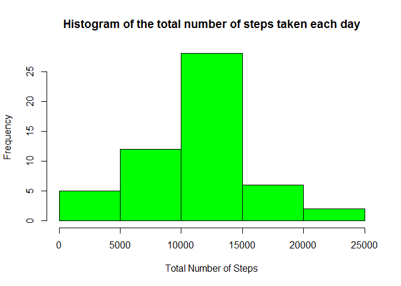
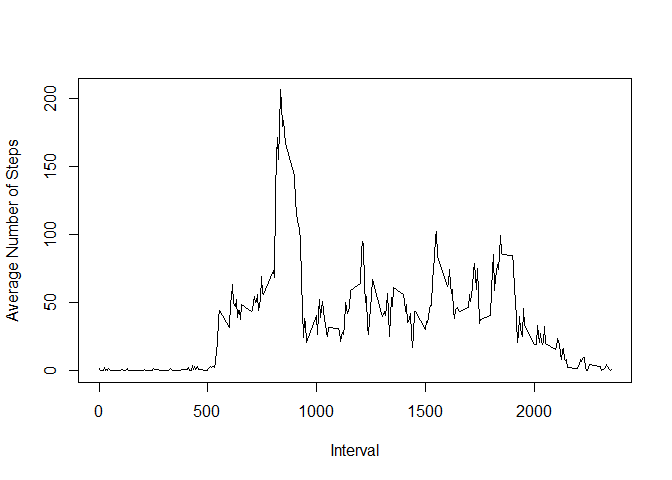
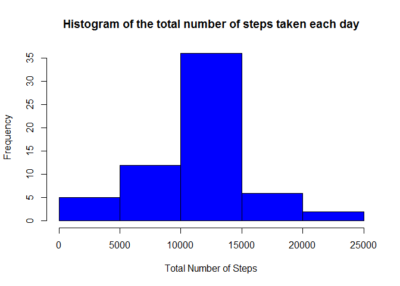

# Markdown Document for Reproducible Analysis Project 1
SK  
January 8, 2017  

This is a markdown document that covers the steps required to complete the Project 1 of Reproducible project. 

Each of the Points highlighted in the document are part of the requirement for the project. The details of indvidual steps carried for generating the output of each point is documented before the start of the code.

##1. Code for reading in the dataset and/or processing the data

The code below shows the reading of data from 'activity.csv' file and store it in a data frame 'activity_data' . It has been assumed that the file is already downloaded in the local directory before the Markdown document is run in R Studio.

The code below extracts all the records where steps value is non NA and store it in DF 'data_rm_na' and then displays the summary for original data and the data without NAs.


```r
activity_data <- read.csv("activity.csv", header=TRUE)
data_rm_na <- activity_data[!is.na(activity_data$steps),]
summary(activity_data)
```

```
##      steps                date          interval     
##  Min.   :  0.00   2012-10-01:  288   Min.   :   0.0  
##  1st Qu.:  0.00   2012-10-02:  288   1st Qu.: 588.8  
##  Median :  0.00   2012-10-03:  288   Median :1177.5  
##  Mean   : 37.38   2012-10-04:  288   Mean   :1177.5  
##  3rd Qu.: 12.00   2012-10-05:  288   3rd Qu.:1766.2  
##  Max.   :806.00   2012-10-06:  288   Max.   :2355.0  
##  NA's   :2304     (Other)   :15840
```

```r
summary(data_rm_na)
```

```
##      steps                date          interval     
##  Min.   :  0.00   2012-10-02:  288   Min.   :   0.0  
##  1st Qu.:  0.00   2012-10-03:  288   1st Qu.: 588.8  
##  Median :  0.00   2012-10-04:  288   Median :1177.5  
##  Mean   : 37.38   2012-10-05:  288   Mean   :1177.5  
##  3rd Qu.: 12.00   2012-10-06:  288   3rd Qu.:1766.2  
##  Max.   :806.00   2012-10-07:  288   Max.   :2355.0  
##                   (Other)   :13536
```

##2. Histogram of the total number of steps taken each day

There are two steps to the process i.e. to identify the total number of steps each day and then generating the histogram of the output.

###a) Get the total number of Steps each day


```r
library(dplyr)
```

```
## Warning: package 'dplyr' was built under R version 3.2.5
```

```
## 
## Attaching package: 'dplyr'
```

```
## The following objects are masked from 'package:stats':
## 
##     filter, lag
```

```
## The following objects are masked from 'package:base':
## 
##     intersect, setdiff, setequal, union
```

```r
by_date <- group_by(data_rm_na, date)
total_steps_date <- summarise(by_date, total_steps=sum(steps))
summary(total_steps_date)
```

```
##          date     total_steps   
##  2012-10-02: 1   Min.   :   41  
##  2012-10-03: 1   1st Qu.: 8841  
##  2012-10-04: 1   Median :10765  
##  2012-10-05: 1   Mean   :10766  
##  2012-10-06: 1   3rd Qu.:13294  
##  2012-10-07: 1   Max.   :21194  
##  (Other)   :47
```

###b) Print the Histogram for the number of Steps each day


```r
hist(total_steps_date$total_steps , col="green", main = "Histogram of the total number of steps taken each day", xlab="Total Number of Steps" )
```

<!-- -->

##3. Mean and median number of steps taken each day

The mean and median values for the Total steps each day is calculated using the below code:


```r
mean_eq <- mean(total_steps_date$total_steps)
median_eq <- median(total_steps_date$total_steps)
summary(total_steps_date$total_steps)
```

```
##    Min. 1st Qu.  Median    Mean 3rd Qu.    Max. 
##      41    8841   10760   10770   13290   21190
```

The mean of steps taken each day is 1.0766189\times 10^{4} and median is 10765

##4. Time series plot of the average number of steps taken

The code below gets the average number of Steps taken for each interval and then is plotted on the graph.


```r
steps_by_interval <- aggregate(steps ~ interval, data_rm_na, mean)
plot( steps_by_interval$interval, steps_by_interval$steps, type = 'l', xlab='Interval', ylab='Average Number of Steps')
```

<!-- -->

##5. The 5-minute interval that, on average, contains the maximum number of steps

The below code is used to get the 5 minute interval that contains the maximum number of steps.


```r
steps_by_interval[steps_by_interval$steps==max(steps_by_interval$steps, na.rm=TRUE),]
```

```
##     interval    steps
## 104      835 206.1698
```

##6. Code to describe and show a strategy for imputing missing data

The logic used to impute the missing data is to get the mean(steps) for each interval and then data is merged with the set of records that contains only NA records.

The dataset with 'NA' records and non 'NA' records is then combined to generate the consolidated dataset.


```r
steps_by_interval_dur <- group_by(data_rm_na,interval)
mean_by_interval_dur <- summarise(steps_by_interval_dur, mean_steps=mean(steps))
data_na <- activity_data[is.na(activity_data$steps),]
new_na_data <- merge(data_na, mean_by_interval_dur, by=c("interval"))
names(new_na_data) <- c( "interval","old steps", "date", "steps")
new_consolidated_data <- rbind(data_rm_na,new_na_data[,c("steps","interval","date")] )
```

##7. Histogram of the total number of steps taken each day after missing values are imputed


```r
by_date_new <- group_by(new_consolidated_data, date)
total_steps_date_new <- summarise(by_date_new, total_steps=sum(steps))
summary(total_steps_date)
```

```
##          date     total_steps   
##  2012-10-02: 1   Min.   :   41  
##  2012-10-03: 1   1st Qu.: 8841  
##  2012-10-04: 1   Median :10765  
##  2012-10-05: 1   Mean   :10766  
##  2012-10-06: 1   3rd Qu.:13294  
##  2012-10-07: 1   Max.   :21194  
##  (Other)   :47
```

```r
summary(total_steps_date_new)
```

```
##          date     total_steps   
##  2012-10-01: 1   Min.   :   41  
##  2012-10-02: 1   1st Qu.: 9819  
##  2012-10-03: 1   Median :10766  
##  2012-10-04: 1   Mean   :10766  
##  2012-10-05: 1   3rd Qu.:12811  
##  2012-10-06: 1   Max.   :21194  
##  (Other)   :55
```

```r
hist(total_steps_date_new$total_steps , col="blue", main = "Histogram of the total number of steps taken each day", xlab="Total Number of Steps" )
```

<!-- -->

##8. Panel plot comparing the average number of steps taken per 5-minute interval across weekdays and weekends


```r
library(lubridate)
```

```
## Warning: package 'lubridate' was built under R version 3.2.5
```

```
## 
## Attaching package: 'lubridate'
```

```
## The following object is masked from 'package:base':
## 
##     date
```

```r
new_consolidated_data <- mutate(new_consolidated_data, weekdaynum = "wd")
new_consolidated_data$weekdaynum <- as.POSIXlt(ymd(new_consolidated_data$date))$wday
new_consolidated_data <- mutate(new_consolidated_data, weekend_flag=ifelse(weekdaynum %in% c(0,6),'weekend','weekday'))
summary(new_consolidated_data)
```

```
##      steps                date          interval        weekdaynum
##  Min.   :  0.00   2012-10-01:  288   Min.   :   0.0   Min.   :0   
##  1st Qu.:  0.00   2012-10-02:  288   1st Qu.: 588.8   1st Qu.:1   
##  Median :  0.00   2012-10-03:  288   Median :1177.5   Median :3   
##  Mean   : 37.38   2012-10-04:  288   Mean   :1177.5   Mean   :3   
##  3rd Qu.: 27.00   2012-10-05:  288   3rd Qu.:1766.2   3rd Qu.:5   
##  Max.   :806.00   2012-10-06:  288   Max.   :2355.0   Max.   :6   
##                   (Other)   :15840                                
##  weekend_flag      
##  Length:17568      
##  Class :character  
##  Mode  :character  
##                    
##                    
##                    
## 
```

```r
by_interval_weekday <- aggregate(steps ~ interval+weekend_flag, new_consolidated_data, mean)

head(new_consolidated_data)
```

```
##   steps       date interval weekdaynum weekend_flag
## 1     0 2012-10-02        0          2      weekday
## 2     0 2012-10-02        5          2      weekday
## 3     0 2012-10-02       10          2      weekday
## 4     0 2012-10-02       15          2      weekday
## 5     0 2012-10-02       20          2      weekday
## 6     0 2012-10-02       25          2      weekday
```

```r
summary(by_interval_weekday)
```

```
##     interval      weekend_flag           steps        
##  Min.   :   0.0   Length:576         Min.   :  0.000  
##  1st Qu.: 588.8   Class :character   1st Qu.:  2.047  
##  Median :1177.5   Mode  :character   Median : 28.133  
##  Mean   :1177.5                      Mean   : 38.988  
##  3rd Qu.:1766.2                      3rd Qu.: 61.263  
##  Max.   :2355.0                      Max.   :230.378
```

```r
library(lattice)
```

```
## Warning: package 'lattice' was built under R version 3.2.5
```

```r
xyplot(steps~interval|weekend_flag,data=by_interval_weekday,type='l', layout=c(1,2) )
```

<!-- -->


